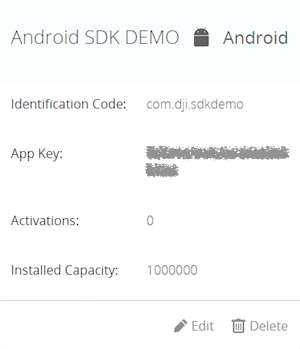

# DJI Mobile SDK for Android

## What Is This?

The DJI Mobile SDK enables you to control how your Phantom’s camera, gimbal, and more behaves and interacts with mobile apps you create.Using the Mobile SDK, create a customized mobile app to unlock the full potential of your DJI aerial platform.

## Running the SDK Sample Code

This guide shows you how to setup APP Key and run our DJI Mobile SDK sample project, which you can download it from this **Github Page**.

### Prerequisites

- Android API Level 16 or higher
- Eclipse 4.4.1 or higher
- Android Studio 1.2 or higher

### Registering a App Key

Firstly, please go to your DJI Account's [User Center](http://developer.dji.com/en/user/mobile-sdk/), select the "Mobile SDK" tab on the left, press the "Create App" button and select "Android" as your operating system. Then type in the info in the pop up dialog.

>Note: Please type in "com.dji.sdkdemo" in the `Identification Code` field, because the application ID in the sample SDK project is "com.dji.sdkdemo".

Once you complete it, you may see the following App Key status:

### Running the Sample Eclipse or Android Studio project

Open the "AndroidManifest.xml" file in Eclipse or Android Studio, modify the **meta-data** element in the **application** element and replace the value of `android:value` with the app key we just created as shown below:

~~~xml
<application
	android:allowBackup="true"
	android:hardwareAccelerated="true"
	android:icon="@drawable/ic_launcher"
	android:label="@string/app_name"
	android:theme="@style/AppTheme" >
	
	<meta-data
		android:name="com.dji.sdk.API_KEY"
		android:value="**********************" />

</application>
~~~

Once you finish it, build and run the project and you can start to try different features in the sample project without any problems.'

## Concepts

- [**DJI Mobile SDK Framework Handbook**](https://github.com/dji-sdk/Mobile-SDK-Handbook): 
This handbook provides a high level overview of the different components that make up the SDK, so that developers can get a feel for the SDK's structure and its different components. This handbook does not aim to provide specific information that can be found in the SDK. After reading through this handbook, developers should be able to begin working closely with the SDK.

## Sample Projects - Basic

- [**Creating a Camera Application**](https://github.com/DJI-Mobile-SDK/Android-FPVDemo): Our introductory tutorial, which guides you through connecting to your drone's camera to display a live video feed in your app, through which you can take photos and videos.

- [**Importing DJI SDK Demo to Android Studio**](http://dji-dev.gitbooks.io/mobile-sdk-tutorials/content/en/Android/AndroidStudioMigration/Android_Studio_Migration_Tutorial_en.html): There are two methods we can use to import the DJI SDK Demo library into Android Studio. The first is to import the Android Studio version of the DJI SDK Demo Library to Android Studio; the second is to import the Eclipse version of the DJI SDK Demo into Android Studio.

## Sample Projects - Advanced

- [**Creating a Photo and Video Playback Application**](https://github.com/DJI-Mobile-SDK/Android-PlaybackDemo): A follow up to the FPV tutorial, this tutorial teaches you how to construct an application to view media files onboard a DJI drone's SD card, specifically for **Phantom 3 Professional** and **Inspire 1**.

- **Creating a MapView and Waypoint Application** ([**GoogleMap**](https://github.com/DJI-Mobile-SDK/Android-GSDemo-GoogleMap) | [**AutoNavi**](https://github.com/DJI-Mobile-SDK/Android-GSDemo-Gaode-Map)): Teaches you how to construct a Groundstation app, which allows you to plot a flight route for your drone by placing waypoints on a map.

- [**Creating a Panorama Application**](https://github.com/DJI-Mobile-SDK/Android-PanoramaDemo):
Learn how to build a cool panorama app. With the help of the powerful DJI SDK and OpenCV libraries, it is actually easy. you will use the Waypoint feature of Intelligent Navigation and Joystick to rotate the aircraft to take photos.

## Gitbook

For better reading experience of DJI Mobile SDK Tutorials, please check our [**Gitbook**](https://dji-dev.gitbooks.io/mobile-sdk-tutorials/).

## SDK Reference

[**Android SDK API Documentation**](http://developer.dji.com/mobile-sdk/documentation/android/)

## Support

You can get support from DJI with the following methods:

- [**DJI Forum**](http://forum.dev.dji.com/en)
- [**Stackoverflow**](http://stackoverflow.com) 
- dev@dji.com
