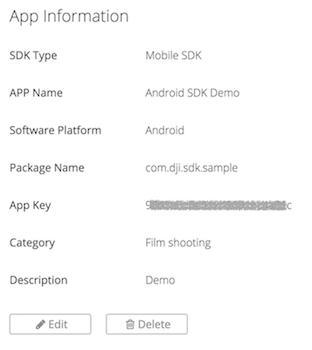
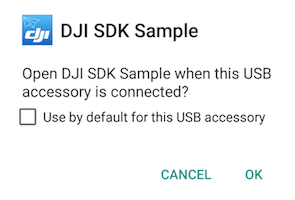
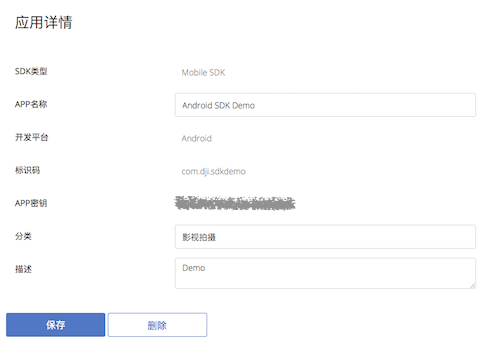

# DJI Mobile SDK for Android

[English](#what-is-this) | [中文](#这是什么)

## What Is This?

The DJI Mobile SDK enables you to control how your Phantom’s camera, gimbal, and more behaves and interacts with mobile apps you create. Using the Mobile SDK, create a customized mobile app to unlock the full potential of your DJI aerial platform.

## Running the SDK Sample Code

This guide shows you how to setup APP Key and run our DJI Mobile SDK sample project, which you can download it from this **Github Page**.

### Prerequisites

- Android API Level 22 or lower
- Android Studio 1.5 or higher

### Registering an App Key

Firstly, please go to your DJI Account's [User Center](http://developer.dji.com/en/user/apps/), select the "Apps" tab on the left, press the "Create App" button and select "Android" as your operating system. Then type in the info in the pop up dialog.

>Note: Please type in "com.dji.sdk.sample" in the `Package Name` field, because the Android Package Name in the sample SDK project is "com.dji.sdk.sample".

Once you complete it, you may see the following App Key status:

### Running the SDK Sample Code in Android Studio

Please download or clone the Github Project repository and navigate to **Sample Code** folder, open it in Android Studio and open the "AndroidManifest.xml" file, modify the **meta-data** element of "com.dji.sdk.API_KEY" in the **application** element and replace the value of `android:value` with the app key we just created as shown below:

~~~xml
<!--
    ADD API_KEY HERE and make sure you
    are connected to the Internet before
    the app is launched
-->
<meta-data
    android:name="com.dji.sdk.API_KEY"
    android:value="" />
~~~

Once you finish it, build and run the project on your Android Device. Then connect the Android device to the Remote Controller, turn on the Remote Controller and the aircraft or handheld device. You can start to try different features in the sample project now!

> **Note:** 
> 
> **1.** Please make sure your DJI Remote Controller supports [AOA](https://source.android.com/devices/accessories/protocol.html) before you test the Sample app. You can upgrade your DJI Remote Controller to the latest firmware and check if there is a dialog pops up when you connect the app to it like this:
> 
> 
> 
> **2.** Please make sure you don't set other Android Apps(Like DJI Go app) as the default launch application. Otherwise, please modify this setting in your Android Device and try to run the Sample Code again.
> 

If you still cannot run the SDK Sample Code successfully, please check this step by step tutorial for details: [Running DJI SDK Sample Code in Android Studio](https://github.com/DJI-Mobile-SDK/Android-RunSDKSampleInAndroidStudio) 

## Importing and Activating the SDK to Android Studio Project

You can check this [tutorial](https://github.com/DJI-Mobile-SDK/Android-ImportAndActivateSDKInAndroidStudio) to learn how to import and activate DJI Android SDK to a newly created Android Studio Project from scratch.

> **Note:** To run our SDK on a Marshmallow device (6.0 and API 23), we need to set the compile and target SDK version to 23 and since we are not able to get the SDK based app(s) to consistently work on API 23 device, let us stay with API 22 and lower. 
> 
> Please set the **targetSdkVersion** in "defaultConfig" of your project's build.gradle(Module: app) to **22** or lower. Here is an example:
> 
> ~~~xml
> defaultConfig {
        applicationId "com.dji.importSDKDemo"
        minSdkVersion 19
        targetSdkVersion 22
        versionCode 1
        versionName "1.0"
    }
> ~~~

## Concepts

- [**DJI Mobile SDK Framework Handbook**](https://github.com/dji-sdk/Mobile-SDK-Handbook): 
This handbook provides a high level overview of the different components that make up the SDK, so that developers can get a feel for the SDK's structure and its different components. This handbook does not aim to provide specific information that can be found in the SDK. After reading through this handbook, developers should be able to begin working closely with the SDK.

- [**Virtual Stick User Guide**](http://developer.dji.com/mobile-sdk/get-started/Virtual-Stick-User-Guide):
This guide provides functionality to turn your mobile device into an intelligent remote controller, through which you can program a more flexible trajectory than using Waypoint missions would allow.

## Sample Projects - Basic

- [**Running DJI SDK Sample Code in Android Studio**](https://github.com/DJI-Mobile-SDK/Android-RunSDKSampleInAndroidStudio): This tutorial will teach you how to run the Android SDK Sample Project in Android Studio. 

- [**Importing and Activating DJI SDK in Android Studio Project**](https://github.com/DJI-Mobile-SDK/Android-ImportAndActivateSDKInAndroidStudio): This tutorial teaches you how to import and activate DJI SDK to your Android Studio project.

- [**Creating a Camera Application**](https://github.com/DJI-Mobile-SDK/Android-FPVDemo): Our introductory tutorial, which guides you through connecting to your drone's camera to display a live video feed in your app, through which you can take photos and videos.

## Sample Projects - Advanced

- [**Creating a MapView and Waypoint Application**](https://github.com/DJI-Mobile-SDK/Android-GSDemo-GoogleMap): Teaches you how to construct a DJIWaypoint Mission app, which allows you to plot a flight route for your drone by placing waypoints on a map. We use Google Map API in this tutorial.

- [**Creating a TapFly and ActiveTrack Missions Application**](https://github.com/DJI-Mobile-SDK/Android-Phantom4Missions):
Learn how to use the TapFly and ActiveTrack Missions of DJI SDK 3.1 to create a cool application for Phantom 4. You will also get familiar with DJIMissionManager and using the Simulator of DJI Assistant 2 for testing.

## Gitbook

For an improved reading experience of DJI Mobile SDK Tutorials, please check our [**Gitbook**](https://dji-dev.gitbooks.io/mobile-sdk-tutorials/).

## SDK Reference

[**Android SDK API Documentation**](http://developer.dji.com/mobile-sdk/documentation/android/)

## Support

You can get support from DJI with the following methods:

- [**DJI Forum**](http://forum.dev.dji.com/en)
- Post questions in [**Stackoverflow**](http://stackoverflow.com) using [**dji-sdk**](http://stackoverflow.com/questions/tagged/dji-sdk) tag
- dev@dji.com

---

## 这是什么?

使用DJI Mobile SDK开发App, 可以控制Phantom的相机，云台等更多部件实现个性化的航拍体验。你可以为DJI飞行平台量身定做移动APP，发挥出飞行器的最大潜力。关于飞行的一切创意，均可成为现实。

## 运行SDK示例代码

本教程展示了如何配置APP Key, 如何运行DJI Mobile SDK的示例代码，示例代码可以在当前的**Github Page**中下载。

### 开发工具版本要求

- Android API Level 22 以上
- Android Studio 1.5 或以上

### 注册App Key

首先, 请来到你的DJI 账号的[用户中心](http://developer.dji.com/cn/user/apps/), 选择左侧的 "应用" 选项，然后点击“创建A应用”按钮，并且选择“Android”作为开发平台. 接着在弹出的对话框中输入信息.

>注意: 请在`Package Name`栏中输入"com.dji.sdk.sample", 因为示例代码中的默认Package Name就是 "com.dji.sdk.sample".

一旦你完成了注册，你将看到以下App Key的状态截图:

请记下刚刚创建好的App Key，我们会在接下来的步骤中用到。

### 运行Android Studio示例代码

请把Github project下载或者clone到本地，然后来到**Sample Code** 文件夹，用Android Studio打开该Android项目工程，打开"AndroidManifest.xml"文件，修改**application**元素中的"com.dji.sdk.API_KEY" **meta-data**元素，替换`android:value`的值为你刚创建的app key，如下所示:

~~~xml
<!--
    ADD API_KEY HERE and make sure you
    are connected to the Internet before
    the app is launched
-->
<meta-data
    android:name="com.dji.sdk.API_KEY"
    android:value="" />
~~~

最后编译运行该工程，安装到你的Android设备上。然后连接Android设备到遥控器，启动遥控器和飞机。你就可以开始流畅地体验实例代码中的不同功能了。

> **注意:** 
> 
> **1.** 在你测试Sample App之前，请确保你的DJI遥控器支持[AOA](https://source.android.com/devices/accessories/protocol.html). 你可以将遥控器升级到最新的固件，然后连接app到遥控器上，观察是否弹出以下对话框来判断:
> 
> 
> 
> **2.** 请检查下有没有将其它Android App（如DJI Go app）设置为默认运行应用，如果有，请修改该设置再运行示例代码。
> 

如果你还无法成功运行SDK的示例代码，请参考这篇教程 :[在Android Studio 中运行DJI SDK示例代码](https://github.com/DJI-Mobile-SDK/Android-RunSDKSampleInAndroidStudio).

## 在Android Studio工程项目中导入并激活SDK

你可以查看这篇[教程](https://github.com/DJI-Mobile-SDK/Android-ImportAndActivateSDKInAndroidStudio)来学习如何在Android Studio工程项目中导入并激活SDK。

> **注意:** 如果你想在Android 6.0 Marshmallow上使用DJI SDK, 你必须将工程的build.gradle(Module: app)文件中的"defaultConfig" 里面的"targetSdkVersion" 参数设置成 **22** 或者更低. 如下所示：
> 
> ~~~xml
> defaultConfig {
        applicationId "com.dji.importSDKDemo"
        minSdkVersion 19
        targetSdkVersion 22
        versionCode 1
        versionName "1.0"
    }
> ~~~
>

## 基本概念

- [**DJI Mobile SDK Framework 指南**](https://github.com/dji-sdk/Mobile-SDK-Handbook): 

本指南针对SDK的各种抽象概念进行了解释，方便开发者对SDK的架构和各种概念有一个清晰的理解。 本指南不会提供SDK的详细信息，具体您可以直接在SDK中了解。在阅读完本指南后，开发者可以更容易上手我们的SDK。

- [**虚拟摇杆使用指南**](http://developer.dji.com/cn/mobile-sdk/get-started/Virtual-Stick-User-Guide/)

本指南针对虚拟摇杆的原理进行了解释，目的是让开发者使用程序进行飞行控制，可以通过SDK实现遥控器模拟。相比于Waypoint的功能，虚拟摇杆显得更加灵活。

## 示例教程 - 基础

- [**在Android Studio 中运行DJI SDK示例代码**](https://github.com/DJI-Mobile-SDK/Android-RunSDKSampleInAndroidStudio): 通过该教材，你将学会如何在Android Studio中运行Android SDK 示例代码。

- [**在Android Studio工程项目中导入并激活 DJI SDK**](https://github.com/DJI-Mobile-SDK/Android-ImportAndActivateSDKInAndroidStudio): 通过该教程，你将学会如何在Android Studio工程项目中导入并激活SDK。

- [**创建航拍相机App**](https://github.com/DJI-Mobile-SDK/Android-FPVDemo): 这是我们的入门教程, 该教材会指导你如何连接飞行器的相机，在app上显示实时画面，以及如何进行拍摄和录像操作。

## 示例教程 - 高级

- [**创建智能飞行预设航点功能App**](https://github.com/DJI-Mobile-SDK/Android-GSDemo-Gaode-Map): 你将学到智能飞行预设航点功能的基本使用流程, 如何升级你的 Inspire 1, Phantom 3 Professional 和 Phantom 3 Advanced的固件到最新版本, 以及如何使用DJI PC 模拟器去测试智能飞行的功能. 该教材使用了高德地图API。

- [**创建指点飞行和视觉追踪任务App**](https://github.com/DJI-Mobile-SDK/Android-Phantom4Missions):
学习如何使用DJI SDK 3.1的指点飞行和视觉追踪任务, 开发一款针对Phantom4的酷炫app。同时，你将熟悉DJIMissionManager的使用方法，以及如何使用DJI Assistant 2 的模拟器做功能测试。

## Gitbook

如果你想拥有更好的阅读体验，可以看下我们的DJI Mobile SDK Tutorials [**Gitbook**](https://dji-dev.gitbooks.io/mobile-sdk-tutorials/).

## SDK API 文档

[**Android SDK API 文档**](http://developer.dji.com/mobile-sdk/documentation/android/)

## 技术支持

你可以从以下方式获得DJI的技术支持：

- [**DJI 论坛**](http://forum.dev.dji.com/cn)
- 请在 [**Stackoverflow**](http://stackoverflow.com)上使用 [**dji-sdk**](http://stackoverflow.com/questions/tagged/dji-sdk) tag提问题
- dev@dji.com