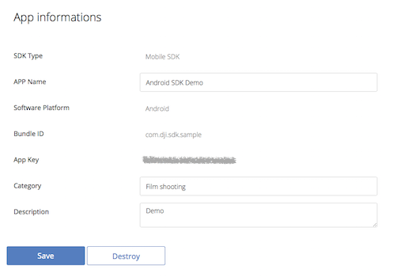
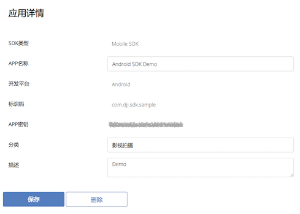

# DJI Mobile SDK for Android

[English](#what-is-this) | [中文](#这是什么)

## What Is This?

The DJI Mobile SDK enables you to control how your Phantom’s camera, gimbal, and more behaves and interacts with mobile apps you create. Using the Mobile SDK, create a customized mobile app to unlock the full potential of your DJI aerial platform.

## Running the SDK Sample Code

This guide shows you how to setup APP Key and run our DJI Mobile SDK sample project, which you can download it from this **Github Page**.

### Prerequisites

- Android API Level 17 or higher
- Android Studio 1.5

### Registering an App Key

Firstly, please go to your DJI Account's [User Center](http://developer.dji.com/en/user/apps/), select the "Mobile SDK" tab on the left, press the "Create App" button and select "Android" as your operating system. Then type in the info in the pop up dialog.

>Note: Please type in "com.dji.sdk.sample" in the `Identification Code` field, because the Android Application ID in the sample SDK project is "com.dji.sdk.sample".

Once you complete it, you may see the following App Key status:

### Running the Sample Android Studio project

Open the "AndroidManifest.xml" file in Android Studio, modify the **meta-data** element in the **application** element and replace the value of `android:value` with the app key we just created as shown below:

~~~xml
<application
	android:allowBackup="true"
	android:hardwareAccelerated="true"
	android:icon="@drawable/ic_launcher"
	android:label="@string/app_name"
	android:theme="@style/AppTheme" >
	
	<meta-data
		android:name="com.dji.sdk.API_KEY"
		android:value="**********************" />

</application>
~~~

Once you finish it, build and run the project and you can start to try different features in the sample project without any problems.

## Concepts

- [**DJI Mobile SDK Framework Handbook**](https://github.com/dji-sdk/Mobile-SDK-Handbook): 
This handbook provides a high level overview of the different components that make up the SDK, so that developers can get a feel for the SDK's structure and its different components. This handbook does not aim to provide specific information that can be found in the SDK. After reading through this handbook, developers should be able to begin working closely with the SDK.

## Sample Projects - Basic

- [**Creating a Camera Application**](https://github.com/DJI-Mobile-SDK/Android-FPVDemo): Our introductory tutorial, which guides you through connecting to your drone's camera to display a live video feed in your app, through which you can take photos and videos.

## Gitbook

For an improved reading experience of DJI Mobile SDK Tutorials, please check our [**Gitbook**](https://dji-dev.gitbooks.io/mobile-sdk-tutorials/).

## SDK Reference

[**Android SDK API Documentation**](http://developer.dji.com/mobile-sdk/documentation/android/)

## Support

You can get support from DJI with the following methods:

- [**DJI Forum**](http://forum.dev.dji.com/en)
- Post questions in [**Stackoverflow**](http://stackoverflow.com) using [**dji-sdk**](http://stackoverflow.com/questions/tagged/dji-sdk) tag
- dev@dji.com

---

## 这是什么?

使用DJI Mobile SDK开发App, 可以控制Phantom的相机，云台等更多部件实现个性化的航拍体验。你可以为DJI飞行平台量身定做移动APP，发挥出飞行器的最大潜力。关于飞行的一切创意，均可成为现实。

## 运行SDK示例代码

本教程展示了如何配置APP Key, 如何运行DJI Mobile SDK的示例代码，示例代码可以在当前的**Github Page**中下载。

### 开发工具版本要求

- Android API Level 16 以上
- Android Studio 1.5

### 注册App Key

首先, 请来到你的DJI 账号的[用户中心](http://developer.dji.com/cn/user/apps/), 选择左侧的 "Mobile SDK" 选项，然后点击“创建App”按钮，并且选择“Android”作为开发平台. 接着在弹出的对话框中输入信息.

>注意: 请在`标识码`栏中输入"com.dji.sdk.sample", 因为示例代码中的默认application ID就是 "com.dji.sdk.sample".

一旦你完成了注册，你将看到以下App Key的状态截图:

请记下刚刚创建好的App Key，我们会在接下来的步骤中用到。

### 运行Android Studio示例代码

在Android Studio中打开"AndroidManifest.xml"文件，修改**application**元素中的**meta-data**元素，替换`android:value`的值为你刚创建的app key，如下所示:

~~~xml
<application
	android:allowBackup="true"
	android:hardwareAccelerated="true"
	android:icon="@drawable/ic_launcher"
	android:label="@string/app_name"
	android:theme="@style/AppTheme" >
	
	<meta-data
		android:name="com.dji.sdk.API_KEY"
		android:value="**********************" />

</application>
~~~

最后编译运行该工程，你就可以开始流畅地体验实例代码中的不同功能了。

## 基本概念

- [**DJI Mobile SDK Framework 指南**](https://github.com/dji-sdk/Mobile-SDK-Handbook): 

本指南针对SDK的各种抽象概念进行了解释，方便开发者对SDK的架构和各种概念有一个清晰的理解。 本指南不会提供SDK的详细信息，具体您可以直接在SDK中了解。在阅读完本指南后，开发者可以更容易上手我们的SDK。

## 示例教程 - 基础

- [**创建航拍相机App**](https://github.com/DJI-Mobile-SDK/Android-FPVDemo): 这是我们的入门教程, 该教材会指导你如何连接飞行器的相机，在app上显示实时画面，以及如何进行拍摄和录像操作。

## Gitbook

如果你想拥有更好的阅读体验，可以看下我们的DJI Mobile SDK Tutorials [**Gitbook**](https://dji-dev.gitbooks.io/mobile-sdk-tutorials/).

## SDK API 文档

[**Android SDK API 文档**](http://developer.dji.com/mobile-sdk/documentation/android/)

## 技术支持

你可以从以下方式获得DJI的技术支持：

- [**DJI 论坛**](http://forum.dev.dji.com/cn)
- 请在 [**Stackoverflow**](http://stackoverflow.com)上使用 [**dji-sdk**](http://stackoverflow.com/questions/tagged/dji-sdk) tag提问题
- dev@dji.com