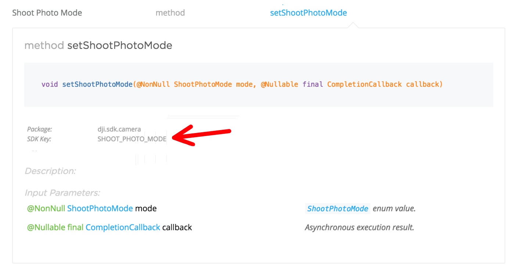

# Keyed Interface

## Overview

SDK 4.0 introduces a new set of interfaces, called _Keyed Interfaces_, to access the state information of the connected DJI product, in addition to the existing interfaces.

You can now access the state information of the product using ***get, set & action*** methods in the newly introduced `KeyManager` using `DJIKey` objects. Also you can listen to state changes using a listener mechanism provided in `KeyManager`.

As part of keyed interface implementation, SDK now contains an in-memory cache that temporarily caches product state information. In many cases, the cache reduces the delay in responding of the SDK as it eliminates the roundtrip getter calls to the product when a valid value is available in the cache.

Below shows an example of accessing ISO value of the camera using the existing interface and the new keyed interface:

***Existing Interface***

~~~java
DJISDKManager.getInstance().getProduct().getCamera().getISO(new CompletionCallbackWith<SettingsDefinitions.ISO>() {
    @Override public void onSuccess(SettingsDefinitions.ISO iso) {
        //Do something with ISO Value
    }

    @Override public void onFailure(DJIError error) {

    }
});	
~~~

***New Keyed Interface***

~~~java
DJIKey isoKey =  CameraKey.create(CameraKey.ISO);
DJISDKManager.getInstance().getKeyManager().getValue(isoKey, new GetCallback() {
    @Override public void onSuccess(@NonNull Object value) {
    
        if (value instanceof SettingsDefinitions.ISO)
        {
            SettingsDefinitions.ISO iso = (SettingsDefinitions.ISO) value;
            //Do something with ISO value
        }
    }

    @Override public void onFailure(@NonNull DJIError error) {

    }
});
~~~

The power of keyed interface becomes apparent in case of state change listeners. In the below example, existing and new keyed interfaces are compared for listening to changes in aircraft altitude.

***Existing Interface***

~~~java
...

//Setup callback object to receive state updates. LIMITATION: ONLY one state update callback can be set up at any point in time. This callback is called 
//at high frequency irrespective of whether aircraft altitude is changed or not.
mFlightController.setStateCallback(new FlightControllerState.Callback() {

    @Override
    public void onUpdate(FlightControllerState state) {
        final float altitude = state.getAircraftLocation().getAltitude();
        //Do something with altitude value
    }
});

~~~

***New Keyed Interface***

~~~java

...

//Create Flightcontroller altitude key object
DJIKey altitudeKey = FlightControllerKey.create(FlightControllerKey.ALTITUDE);

//Add a listener with KeyListener callback for altitude key. NOTE: You can add multiple listeners for the same key
DJISDKManager.getInstance().getKeyManager().addListener(altitudeKey, new KeyListener() {
    @Override public void onValueChange(@Nullable Object oldValue, @Nullable Object newValue) {
        if (newValue instanceof Float) {
            final float altitude = (Float) newValue;
            //Do something with altitude value
        }
    }
});
...

~~~

## Advantages of Keyed Interfaces

- **Multiple Listeners**: You can add multiple listeners to keys allowing different parts of your code to get notified on status changes.
- **Less Noisy Callbacks**: The listener callbacks are called only on status changes reducing the number of times callbacks are called.
- **Improved UI layer code**: The listener mechanism simplifies view layer code significantly. Infact, the recently announced DJI UI Library only uses the keyed interface of the SDK.

## Overview of Keyed Interface Classes

### `DJIKey`

* `DJIKey` acts as an "address" to a state information of the connected product. 
* Each component in the SDK (eg. Camera, FlightController, etc.) has its own subclass of `DJIKey` (eg. `CameraKey`, `FlightControllerKey`, etc.).
* In order to create a DJIKey object, use the class constructor method with static string "param keys". You can obtain the param keys for an interface or state of a component from the documentation of its existing interface. You can also find all the available param keys of DJIKey subclass in class file.

* Examples of `DJIKey` constructor methods

~~~java
DJIKey cameraShootPhotoModeKey = CameraKey.create(CameraKey.SHOOT_PHOTO_MODE);
    
//Addresses specific battery if the product has multiple batteries (eg. Matrice 600)
DJIKey chargeRemainingOfBattery2Key = BatteryKey.create(BatteryKey.CHARGE_REMAINING, 2);

DJIKey isFlyingKey = FlightControllerKey.create(FlightControllerKey.IS_FLYING);

~~~

For more information on this class please refer to `DJIKey` class documation.

### KeyManager

[KeyManager](./API_Reference/Components/KeyManager/DJIKeyManager.html) acts as gateway to keyed interfaces. It offers ***get, set & action*** methods, and ***add, remove listener*** methods. Please refer to [KeyManager](./API_Reference/Components/KeyManager/DJIKeyManager.html) documentation for more information on this class.

## Sample Code

You can find the keyed interface sample code in this Github Sample Code.